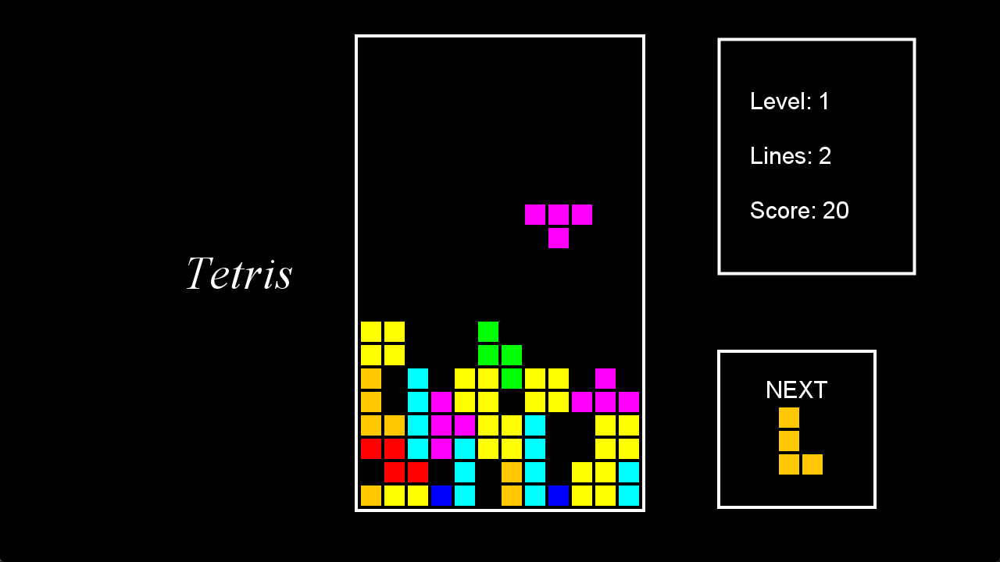
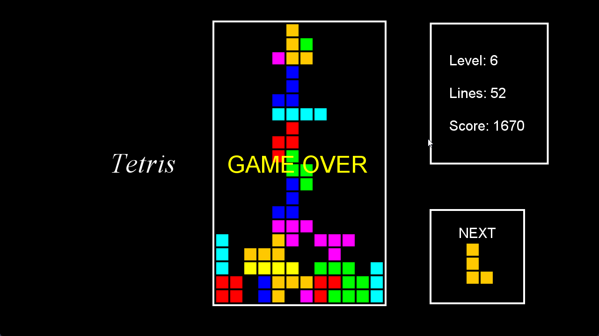

# Tetris

This project is a Java-based clone of the classic arcade game Tetris, developed with Java Swing for the graphical user interface. It faithfully replicates the traditional Tetris gameplay, where players rotate and maneuver falling blocks to complete lines and score points.




## Features

- **Classic Gameplay:** Enjoy the timeless Tetris experience with authentic falling tetrominoes.
- **Scoring and Levels:** Track your progress as you advance through increasingly challenging levels.
- **Customizable Key Bindings:** Tailor the controls to fit your preferences.
- **Simple GUI:** Built with Java Swing for a clean, responsive interface.
- **Pause/Resume Functionality:** Easily pause and resume your game at any time.

## Installation

1. **Clone the Repository:**
   ```bash
   git clone https://github.com/Princelad/Tetris.git
   cd Tetris
   ```

2. **Build the Project:**
   Open the project in your preferred Java IDE and build it using the provided source files.

3. **Run the Game:**
   Execute the main class (`Main.java`) to start playing.

## Controls

- **Move Left:** `Left Arrow`
- **Move Right:** `Right Arrow`
- **Rotate:** `Up Arrow`
- **Soft Drop:** `Down Arrow`
- **Pause/Resume:** `Esc` Key

## How It Works

The game operates on a simple state machine that manages gameplay elements like block generation, movement, collision detection, and line clearing. The Java Swing library handles the rendering of the game window and user input. The main loop updates the game state based on player actions and automatically drops tetrominoes over time.

## Contributing

Contributions are welcome! To contribute:

1. Fork the repository.
2. Create a new branch.
3. Implement your feature or bug fix.
4. Submit a pull request with a clear description of your changes.

## License

This project is licensed under the MIT License. See the [LICENSE](LICENSE) file for more details.

## Author

- **Prince Lad** - [Princelad](https://github.com/Princelad)  
  Prince is a software developer with a passion for creating engaging and educational software projects. This Tetris clone was developed as a personal project to explore and understand game development principles in Java.

## Acknowledgments

- **Alexey Pajitnov:** Creator of the original Tetris game.
- **Java Swing Community:** For their contributions to the graphical interface.
- **Video Tutorial:** Special thanks to the [YouTube tutorial](https://www.youtube.com/watch?v=N1ktYfszqnM&t=2365s) that inspired and guided the development of this project.
